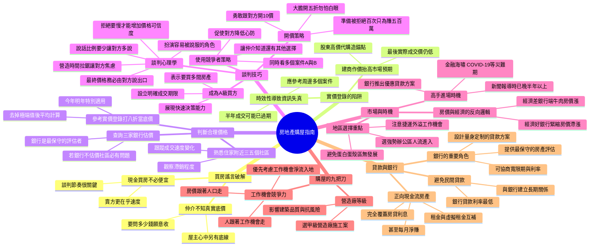
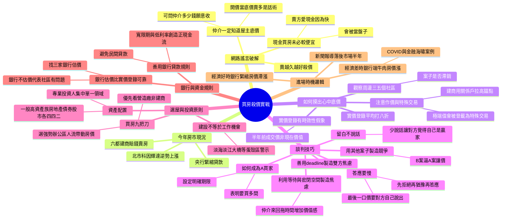
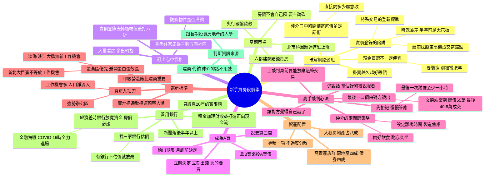

# §9.2 摘要／心智圖模型對照：Haiku vs Sonnet vs Opus

**樣本**：EP242 全集逐字稿（178 段 / 17,277 字）
**環境**：本機 `claude -p --output-format json`
**日期**：2026-09-17

> **本文件供使用者判斷後定案。Claude 不自行決定模型。**

---

## 一、額度與耗時

`claude -p` 每次啟動有與輸入長度無關的固定 cache 開銷，
故不可只比 `total_cost_usd`，須看 `output_tokens`（spec §9.2）。

| 欄位 | Haiku 4.5 | Sonnet 5 | Opus 5 |
|---|---|---|---|
| **output_tokens** | 1889 | **1152** | 1471 |
| 其中 thinking | 552 | 43 | 9 |
| cache_creation | 69,453 | 52,307 | 68,979 |
| cache_read | 45,487 | 80,485 | 86,141 |
| 耗時 | 約 75 秒 | 約 30 秒 | **約 23 秒** |

**反直覺結果：Haiku 最慢且 output 最多。** 它花了 552 token 在 thinking 上
（Sonnet 43、Opus 9），心智圖也最長（77 行）。

---

## 二、若改用 Claude API 的成本

訂閱額度制下三者都「免費」，但若未來切換為 `ClaudeApiProvider`，成本差異如下。

**定價**（Anthropic 第一方 API，$/1M tokens）

| 模型 | 輸入 | 輸出 | Context |
|---|---|---|---|
| Haiku 4.5 | $1.00 | $5.00 | 200K |
| Sonnet 5 | $2.00 | $10.00 | 1M |
| Opus 5 | $5.00 | $25.00 | 1M |

**單集成本**（輸入以 17,277 中文字估算，中文約 1 字 1.8 token → 約 31,100 tokens）

| 模型 | 單集 | 100 集 | 1000 集 |
|---|---|---|---|
| **Haiku 4.5** | **$0.0405** | **$4.05** | **$40.54** |
| Sonnet 5 | $0.0737 | $7.37 | $73.72 |
| Opus 5 | $0.1923 | $19.23 | $192.27 |

> ⚠️ **輸入 token 為估算值**，非實測。本機無 API key，無法用 `count_tokens` 實測。
> 中文 tokenizer 比例取 1.8（範圍 1.6–2.0），實際成本可能有 ±15% 誤差。

**成本比**：以 Haiku 為基準，Sonnet 約 **1.8x**、Opus 約 **4.7x**。

成本主要由**輸入**主導（逐字稿 31K tokens vs 輸出 1-2K），
故單價差距幾乎等比反映在總成本上，輸出長度的影響有限。

**降低成本的可行做法**（若未來採用 API）：
- **Batch API**：非即時處理可享 50% 折扣
- **Prompt caching**：同一集反覆重新生成時，第二次起輸入降至 0.1x

---

## 三、摘要對照

### Haiku 4.5（186 字）

這集專訪房地產投資專家陳宏旭，破解買房常見謠言並傳授實務技巧。重點包括：現金買房未必便宜、實價登錄因時效性常失真、判斷合理價格應看周邊社區與銀行估價而非盲信實價。談判方面強調講少話讓對方說話、製造競爭者壓力、拉長交涉時間降低對方心防。購屋時應選甲級營造廠、關注工作機會流入地區。最關鍵的投資邏輯是「經濟差銀行端牛肉房價漲」，高手應在災難時機大舉進場，領先媒體報導半年以上。

### Sonnet 5（179 字）

本集邀請房地產專家陳宏旭（大叔）分享買房殺價實戰。破解現金買房較便宜、仲介底價等迷思，並教如何用實價登錄打八折估底價、觀察社區滯銷程度判斷議價空間。深入談判技巧：慢答應、以B案逼A案、扮演A買家、留白不說話、讓對方親口說出最後價格。也講解選屋標準（甲級營造廠、強勢辦公區）、資產配置比例、銀行估價與貸款規則的重要性，並提出「經濟差銀行端牛肉」的進場時機邏輯。

### Opus 5（227 字）

博恩邀請房產投資人陳宏旭（大叔）教新手殺價買房。節目先破解常見迷思：現金買房不一定便宜；「開價就是底價」多半是話術；實價登錄有時間落差，也可能被人為墊高。大叔認為現在央行信用管制、市場悲觀，是買方進場的好時機，建議用實價登錄均價打八折當底價，並拿其他物件來比價、讓自己看起來是「A買」（決定快、付錢快、真心要買）。談判時少說話、答應要慢，讓對方親口喊出最後價格。挑房看營造廠等級與工作機會。最後談到要請銀行估價、善用貸款，以及「經濟差時反而是進場時機」。

### 觀察

| 項目 | Haiku 4.5 | Sonnet 5 | Opus 5 |
|---|---|---|---|
| 字數（要求 100 字） | 186 | 179 | 227 |
| 涵蓋全集 | ✅ | ✅ | ✅ |
| 具體談判手法 | 較概略 | 列出五項 | 列出五項並解釋 A買 定義 |
| 提及主持人 | ❌ | ❌ | ✅ 點出博恩為提問方 |

三者皆超出 100 字，依 spec §11 決策 6「稍微超過可接受」。
Opus 最長（227 字），但也最完整——唯一交代了節目的問答結構。

---

## 四、心智圖對照

三份皆通過 Mermaid 語法檢查並成功渲染（截圖 `mm3.png`）：

| 項目 | Haiku 4.5 | Sonnet 5 | Opus 5 |
|---|---|---|---|
| 行數 | 77 | 58 | 62 |
| 最大層級 | 4 | 4 | 4 |
| 語法錯誤 | 0 | 0 | 0 |
| 根節點 | 房地產購屋指南 | 買房殺價實戰 | 新手買房殺價學 |
| 特色 | 分支最多最細 | 結構最聚焦 | **含逐字稿實際數字** |

Opus 的心智圖出現「文德站案例 開價55萬 最後40.8萬成交」「大叔房地產占八成」
等逐字稿中的具體案例與數字，另兩者僅有抽象概念。

---

## 五、完整 Mermaid 原始碼

### Haiku 4.5

### Sonnet 5

### Opus 5

---

## 六、待使用者決定

- [ ] 摘要採用：**Haiku 4.5** / **Sonnet 5** / **Opus 5**
- [ ] 心智圖採用：**Haiku 4.5** / **Sonnet 5** / **Opus 5**

兩者可分開設定（`.env` 的 `CLAUDE_CLI_MODEL_SUMMARY` / `CLAUDE_CLI_MODEL_MINDMAP`）。

現階段使用 `claude -p` 吃訂閱額度，成本差異不反映在帳單上；
第二節的 API 成本供未來切換 `ClaudeApiProvider` 時參考。
